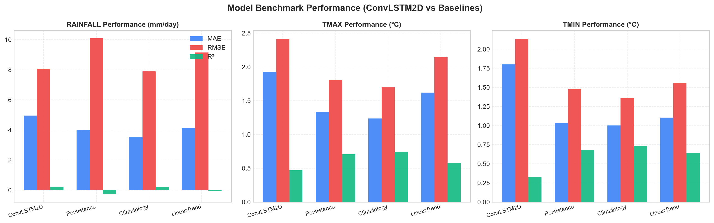

# HavaMana Climate Digital Twin

AI-powered climate digital twin with a React + Vite frontend and a Flask + TensorFlow backend.

The first pilot region is Karnataka, with Bengaluru as the primary dashboard location. The interface is designed for government planners, agriculture groups, climate researchers, and the public.

A ConvLSTM2D model forecasts rainfall, maximum temperature, and minimum temperature, and is benchmarked against Climatology, Persistence, and Linear Trend baselines.

## Run locally

### Requirements

- Node.js 18+
- Python 3.11

### Install

```bash
npm install
pip install -r backend/requirements.txt
```

### Start

```bash
npm run dev
```

This starts both the Flask API (port 5005) and the Vite dev server.

To run them separately:

```bash
npm run dev:backend    # Flask API only (or start_backend.bat on Windows)
npm run dev:frontend   # Vite UI only
```

Other commands:

```bash
npm run build
npm run lint
```

## Project structure

```
src/                    React frontend
  pages/                Dashboard, Model, Comparisons, Scenarios
  components/           Globe, 3D terrain, top bar, search, date picker
  hooks/                API health check and live conditions
  styles/               Design tokens and chart theme
backend/
  api/app.py            Flask API
  data_pipeline/        Reading, preprocessing, and sequence building
  models/               ConvLSTM2D model and baselines
  training/             Training loop
  evaluation/           Metrics and plots
  saved_models/         Trained model and scaler parameters
  outputs/              Evaluation figures and metrics
data/                   Raw climate grids (not committed, see data/README.md)
```

## API endpoints

| Method | Endpoint                | Description                     |
| ------ | ----------------------- | ------------------------------- |
| GET    | `/api/health`           | API and model status            |
| GET    | `/api/spatial-metadata` | Grid coordinates for the region |
| GET    | `/api/metrics`          | Model evaluation metrics        |
| GET    | `/api/forecast/date`    | Forecast for a given date       |
| GET    | `/api/forecast/future`  | Forecast for future days        |
| GET    | `/api/forecast/latest`  | Most recent forecast            |
| POST   | `/api/predict`          | Run a custom prediction         |

## Model training

```bash
cd backend
python train.py      # train the ConvLSTM2D model
python evaluate.py   # generate metrics and figures in backend/outputs/
```

## Results



More figures are in [backend/outputs/figures](backend/outputs/figures).
